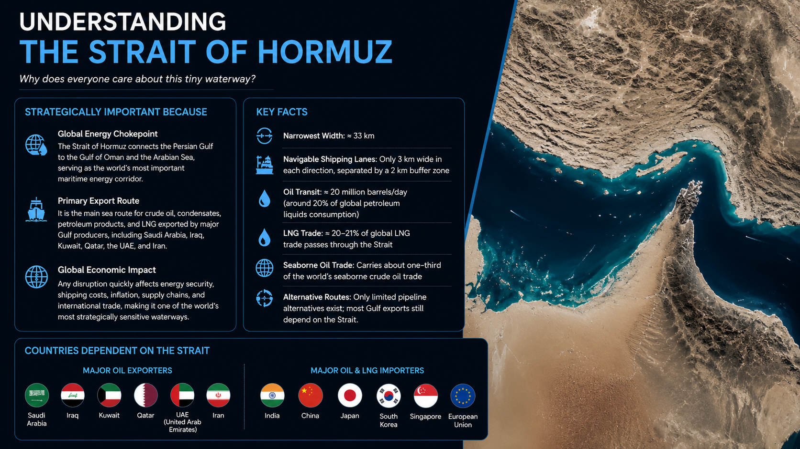
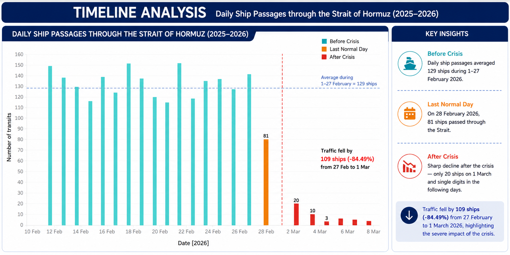
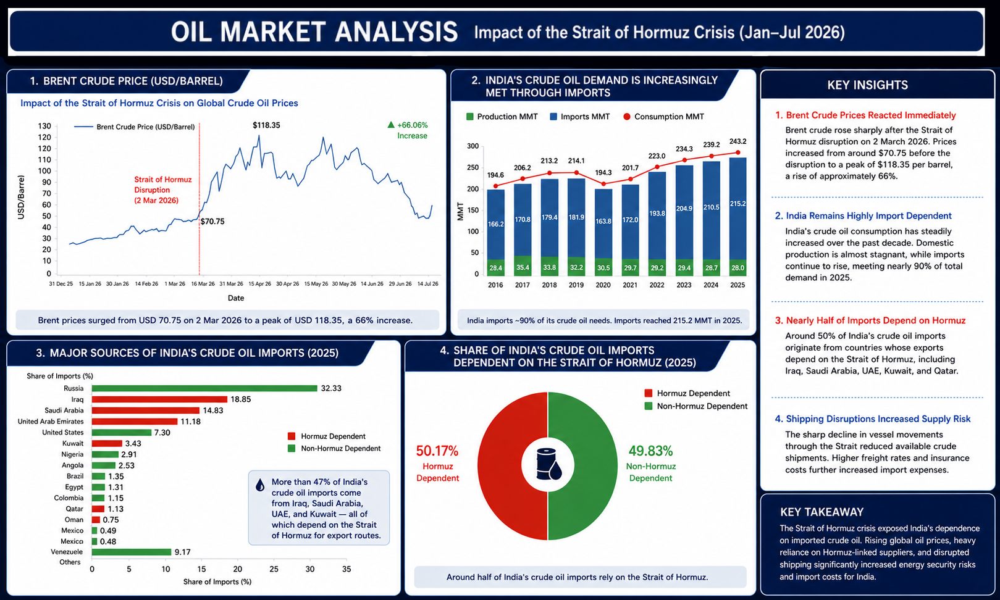
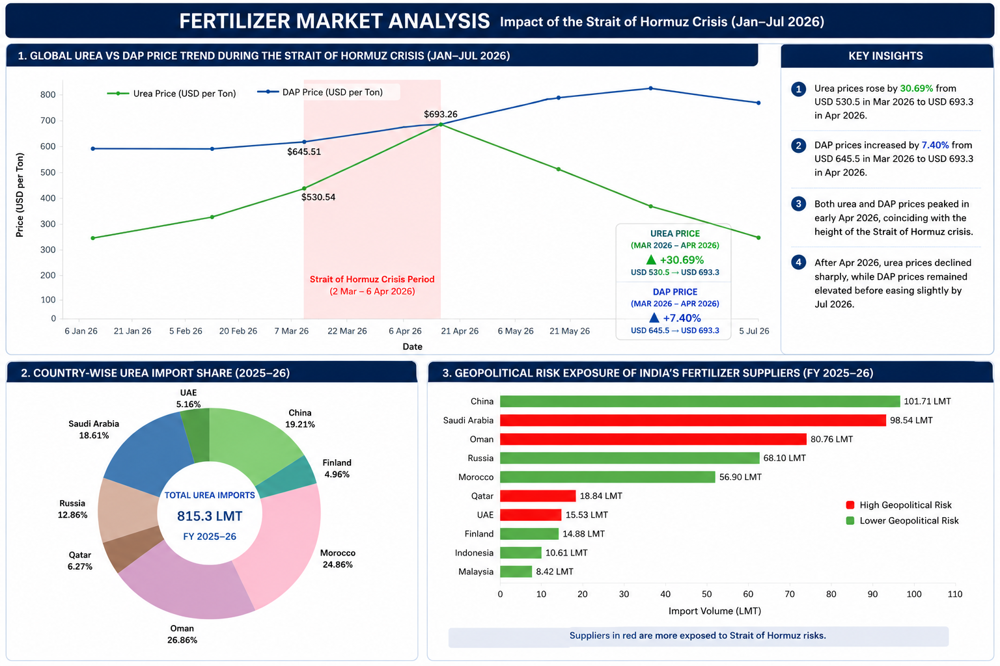
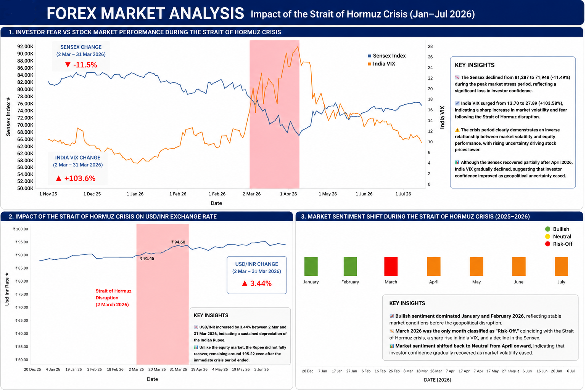
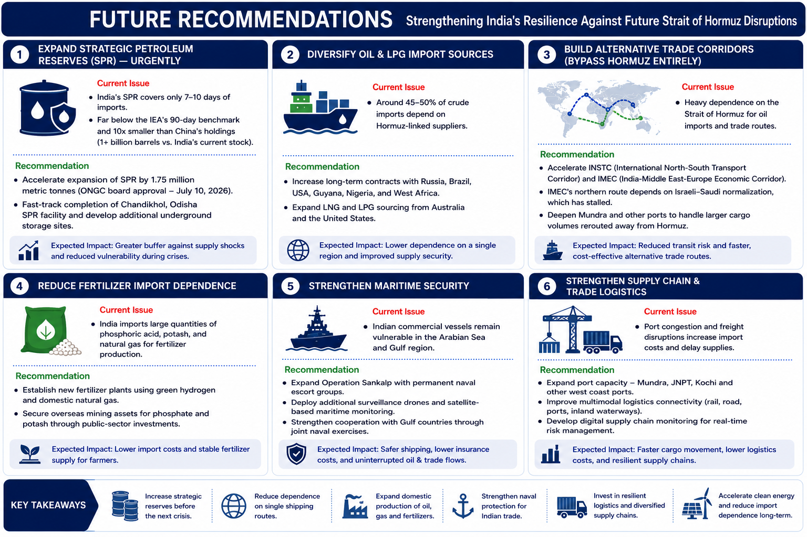

# 🌍 Ripple Effect of the Strait of Hormuz Crisis on India's Economy

## 📌 Project Overview

The **Strait of Hormuz** is one of the world's most strategically
important maritime chokepoints, through which nearly **20% of global
crude oil** and a significant share of **LNG trade** pass every day. Any
disruption in this narrow waterway has immediate consequences for global
energy markets, shipping, inflation, and economic stability.

This project analyzes the **hypothetical 2026 Strait of Hormuz Crisis**
and evaluates its impact on **India's economy** using **Tableau
dashboards** and publicly available datasets. The analysis covers the
effects on crude oil prices, fertilizer markets, foreign exchange,
maritime shipping, government responses, and future policy
recommendations.

The objective is to demonstrate how geopolitical events create ripple
effects across multiple sectors of the Indian economy and how government
interventions can mitigate their impact.

------------------------------------------------------------------------

# 🏗️ Project Architecture

``` text
                     Data Collection
                           │
                           ▼
                    Data Cleaning
                           │
                           ▼
              Data Transformation (Excel)
                           │
                           ▼
             Tableau Dashboard Development
                           │
                           ▼
              Sector-wise Impact Analysis
        (Oil • Fertilizer • Forex • Shipping)
                           │
                           ▼
           Government Response Evaluation
                           │
                           ▼
          Future Recommendations & Insights
```

------------------------------------------------------------------------

# 📂 Dataset Sources

The datasets used in this project were collected from publicly available
government reports, international organizations, financial market
platforms, and industry publications.

## 🇮🇳 Government Sources

-   Ministry of Petroleum & Natural Gas (MoPNG)
-   Petroleum Planning & Analysis Cell (PPAC)
-   Reserve Bank of India (RBI)
-   Ministry of Chemicals & Fertilizers
-   Department of Fertilizers
-   Ministry of Commerce & Industry
-   Directorate General of Commercial Intelligence and Statistics
    (DGCI&S)

## 🌍 International Organizations

-   International Energy Agency (IEA)
-   World Bank
-   International Monetary Fund (IMF)
-   FAOSTAT
-   OECD
-   UN Comtrade
-   International Fertilizer Association (IFA)

## 📈 Financial & Commodity Data

-   Yahoo Finance
-   Investing.com
-   Trading Economics
-   World Bank Commodity Price Data (Pink Sheet)

## 🚢 Shipping & Maritime Data

-   MarineTraffic
-   Lloyd's List Intelligence
-   BIMCO
-   Clarksons Research

## 📊 Additional Reference Sources

-   U.S. Energy Information Administration (EIA)
-   OPEC Monthly Oil Market Reports
-   BP Statistical Review of World Energy
-   Worldometer (Reference Statistics)

------------------------------------------------------------------------

# 📊 Dashboard Sections

## 1️⃣ Understanding the Strait of Hormuz

-   Strategic importance
-   Global energy chokepoint
-   Major exporters and importers
-   Why the Strait matters to India

**Dashboard**



------------------------------------------------------------------------

## 2️⃣ Timeline Analysis

-   Daily ship passages
-   Shipping disruption timeline
-   Crisis period visualization

**Dashboard**



------------------------------------------------------------------------

## 3️⃣ Oil Market Analysis

-   Brent crude price movement
-   India's crude oil demand
-   Import dependency
-   Country-wise crude imports

**Dashboard**



------------------------------------------------------------------------

## 4️⃣ Fertilizer Market Analysis

-   Urea and DAP price trends
-   Fertilizer import dependence
-   Supplier geopolitical risk

**Dashboard**



------------------------------------------------------------------------

## 5️⃣ Forex Market Analysis

-   Sensex vs India VIX
-   USD/INR exchange rate
-   Market sentiment during the crisis

**Dashboard**



------------------------------------------------------------------------

## 6️⃣ Government Response

-   Fuel price stabilization
-   LPG supply protection
-   Fertilizer subsidies
-   RBI intervention
-   Naval security
-   Strategic petroleum measures
-   Trade and logistics support

**Dashboard**



------------------------------------------------------------------------

## 7️⃣ Future Recommendations

-   Expand Strategic Petroleum Reserves
-   Diversify oil and LPG imports
-   Reduce fertilizer import dependence
-   Strengthen maritime security
-   Improve supply chain resilience
-   Build alternative trade corridors

**Dashboard**


------------------------------------------------------------------------

# 🛠️ Tools & Technologies

-   Tableau
-   Microsoft Excel
-   Python

------------------------------------------------------------------------

# 📌 Disclaimer

This project is created for **educational and research purposes**.

-   The datasets were collected from multiple publicly available
    sources, including government agencies, international organizations,
    financial platforms, and industry reports.
-   Since the data originates from different sources, reporting periods,
    methodologies, and update frequencies may vary. As a result, some
    values may differ slightly across sources.
-   Every effort has been made to use reliable and consistent data;
    however, this project should not be considered an official
    government or financial report.
-   The analysis and conclusions are intended to demonstrate data
    visualization, analytical techniques, and economic impact assessment
    rather than provide investment or policy advice.

------------------------------------------------------------------------

# 🤖 AI-Assisted Dashboard Design

This project uses **Tableau** for data visualization and dashboard
development.

To improve the presentation and make the dashboards easier to
understand:

-   Tableau was used to create the charts and visualizations.
-   Microsoft Excel was used for data cleaning and transformation.
-   Python was used for preprocessing and data analysis where required.
-   ChatGPT was used to enhance the presentation by improving dashboard
    layouts, visual storytelling, slide design, titles, annotations, and
    insight formatting.

> **Note:** The underlying datasets were **not generated by AI**.
> ChatGPT was used only to improve the presentation and readability of
> the dashboards.

------------------------------------------------------------------------

# 📈 Original Tableau Visualizations

The presentation includes dashboard-style slides created for
storytelling.

If you would like to view the **original Tableau charts**, you can find
them in the repository under:

``` text
visualizations/
├── crude_oil_analysis/
├── fertilizer_analysis/
├── forex_analysis/
├── traffic_analysis/
└── overall_analysis/
```

Each folder contains the original chart images exported from Tableau,
allowing you to compare the individual visualizations with the final
presentation dashboards.
